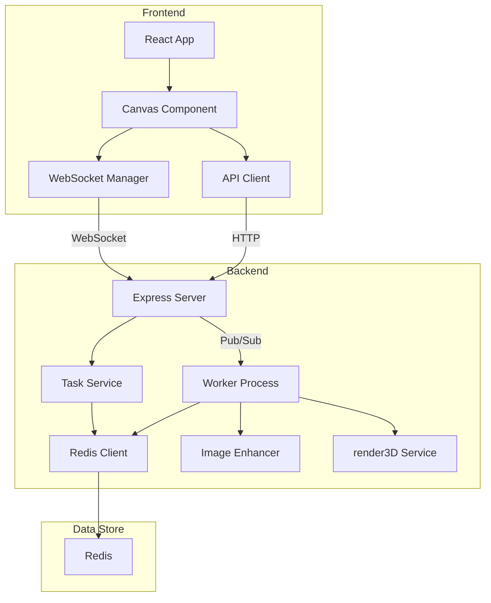

# Vibe3D 🎨

A real-time drawing and 2D-to-3D enhancement application. Draw on a canvas, enhance your sketches with AI, and generate interactive 3D models from your drawings.

## Architecture Overview



## Features

- 🎨 Real-time drawing canvas (2D/3D toggle)
- ✨ AI-powered image enhancement (Google Gemini)
- 📤 Parallel image enhancement with Worker-Thread
- 🧊 2D-to-3D model generation (Anthropic Claude)
- 🔄 Live updates via WebSocket
- 🎯 Asynchronous task processing

## How it Works

1. **Draw**: Create sketches on the canvas (powered by tldraw).
2. **Enhance**: Select a drawing and enhance it using Google Gemini for a cleaner, stylized image.
3. **Render 3D**: Convert the enhanced image to a 3D model using Anthropic Claude, which generates Three.js code.
4. **Interact**: View and manipulate the 3D model in the browser (Three.js + React Three Fiber).

## Tech Stack

### Frontend
- React, tldraw, Zustand, Three.js, @react-three/fiber, WebSocket

### Backend
- Express.js, Redis (Task Queue & Pub/Sub), Worker Threads
- **AI APIs:**
  - Google Gemini (image enhancement, code extraction)
  - Anthropic Claude (3D model code generation)

## Project Structure

```
vibe3D/
├── frontend/
│   ├── src/
│   │   ├── components/
│   │   ├── store/
│   │   └── lib/
│   └── package.json
├── backend/
│   ├── express-backend/
│   ├── worker/
│   └── shared/
└── README.md
```

## Quick Start

1. Clone the repository
```bash
git clone https://github.com/saumya-vyas/vibe3D.git
cd vibe3D
```

2. Install dependencies
```bash
# Frontend
cd frontend
npm install
# Backend
cd ../backend
npm install
```

3. Set up environment variables:
   - **Backend:** In `backend/.env` (see code for required keys: REDIS_URL, ENHANCER_API, EXTRACTER_API, ANTHROPIC_API_KEY)
   - **Frontend:** In `frontend/.env` (set variables like VITE_API_URL or any other required by your frontend)

4. Start services:
```bash
redis-server (Docker)
cd backend/express-backend && node PrimaryBE.js
cd ../worker && node index.js
cd ../../frontend && npm run dev
```

## Acknowledgements

Parts of this project are based on code from [martin226/vibe-draw](https://github.com/martin226/vibe-draw).

## License

This project is licensed under the GNU Affero General Public License v3.0. See the [LICENSE](LICENSE) file for details.
