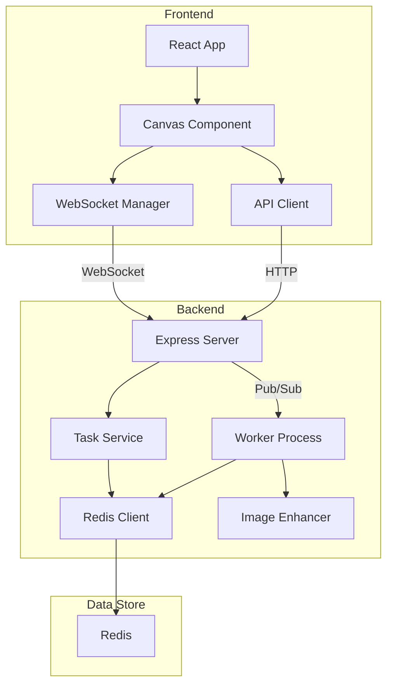

# Vibe-Draw 🎨

A real-time drawing and image enhancement application that uses Google's Gemini Pro Vision to enhance your drawings.

## Architecture Overview



## Features

- 🎨 Real-time drawing canvas
- ✨ AI-powered image enhancement
- 🔄 Real-time updates via WebSocket
- 🎯 Asynchronous task processing
- 🎭 2D/3D view toggle

## Tech Stack

### Frontend
- React
- tldraw (Canvas)
- Zustand (State Management)
- WebSocket for real-time updates

### Backend
- Express.js
- Redis (Task Queue & Pub/Sub)
- Worker Threads
- Google Gemini Pro Vision API

## Quick Start

1. Clone the repository
```bash
git clone https://github.com/yourusername/vibe-draw.git
cd vibe-draw
```

2. Install dependencies
```bash
# Install frontend dependencies
cd frontend
npm install

# Install backend dependencies
cd ../backend
npm install
```

3. Set up environment variables
```bash
# In backend/.env
REDIS_URL=redis://localhost:6379
GOOGLE_API_KEY=your_api_key
```

4. Start the services
```bash
# Start Redis (if not running)
redis-server

# Start Express backend
cd backend/express-backend
npm start

# Start Worker
cd backend/worker
npm start

# Start Frontend
cd frontend
npm run dev
```

5. Open http://localhost:5173 in your browser

## Project Structure

```
vibe-draw/
├── frontend/
│   ├── src/
│   │   ├── components/
│   │   ├── store/
│   │   └── lib/
│   └── package.json
├── backend/
│   ├── express-backend/
│   ├── worker/
│   └── shared/
└── docs/
```

## Documentation

Detailed documentation is available in the `docs` directory:

- [Architecture Overview](docs/architecture/overview.md)
- [Frontend Guide](docs/architecture/frontend.md)
- [Backend Guide](docs/architecture/backend.md)
- [API Reference](docs/api/endpoints.md)

## Contributing

1. Fork the repository
2. Create your feature branch (`git checkout -b feature/amazing-feature`)
3. Commit your changes (`git commit -m 'Add some amazing feature'`)
4. Push to the branch (`git push origin feature/amazing-feature`)
5. Open a Pull Request

## License

This project is licensed under the MIT License - see the [LICENSE](LICENSE) file for details. 